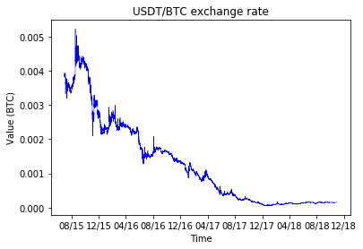
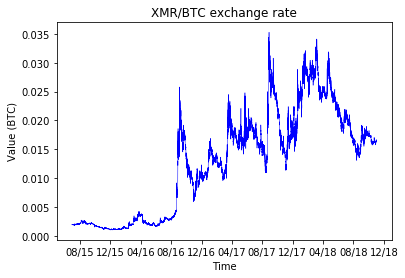
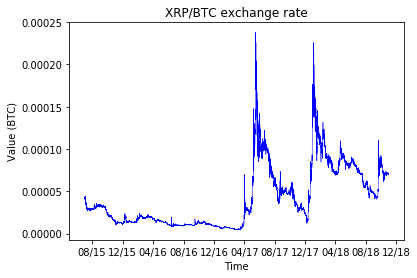
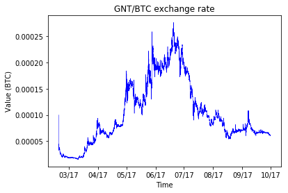
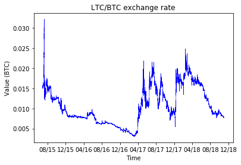
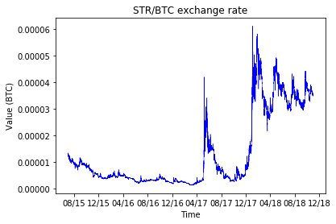

[](http://quantlet.de/)

## [](http://quantlet.de/) **RL_CoinFigures** [](http://quantlet.de/)

```yaml

Name of Quantlet: RL_CoinFigures

Published in: 'A leveraged investment strategy using Deep Reinforcement Learning'

Description: 'Draws figures of all coin prices used in the Thesis experiments relative to Bitcoin (from 07/2015 to 10/2018).'

Keywords: 'reinforcement learning, neural network, machine learning, portfolio management, cryptocurrency'
 
Author: Ilyas Agakishiev

See also: RL_MainComputation, RL_CoinReturnsFigures

Submitted: 23.04.2019

Input: 
- df: "Coin prices, contained in the CSV-files of the 'Database' folder"

```
















### PYTHON Code
```python

import pandas as pd
import matplotlib.pyplot as pl
import matplotlib.dates as mdates

coin = ["ETC", "BCH", "DASH", "DGB", "ETH", "FCT", "GNT", "LTC", "rev_USDT", 
        "STR", "XEM", "XMR", "XRP", "ZEC"]

for i in coin:
    # Import from "Database"
    df      = pd.read_csv("<path>/" + i + ".csv")
    df.date = df.date.astype(int)
    df      = df[df.date % 900 == 0]
    df      = df.sort_values(by = "date")
    df.date = pd.to_datetime(df.date, unit = 's')
    df      = df[df.date >= "07/01/2015"]
    df      = df[df.date < "11/01/2018"]
    
    fig, ax = pl.subplots(figsize = (6, 4))
    pl.plot(df.date, df.close, color = "blue", linewidth = 0.5)
    ax.xaxis.set_major_formatter(mdates.DateFormatter("%m/%y"))
    pl.xlabel("Time") 
    pl.ylabel("Value (BTC)")
    pl.title(i + "/BTC exchange rate")
    if (i == "rev_USDT"):
        pl.title("USDT/BTC exchange rate")
    fig.savefig(i + ".png", bbox_inches = "tight")
```

automatically created on 2019-05-13