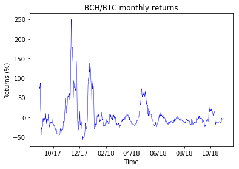
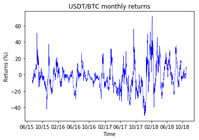
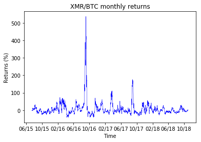
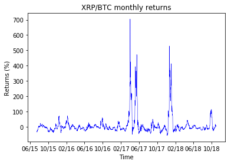
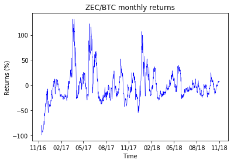
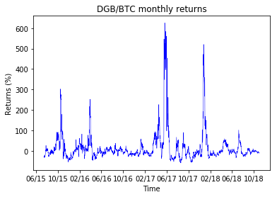
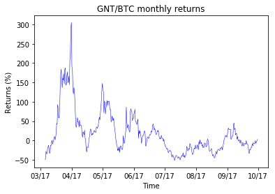
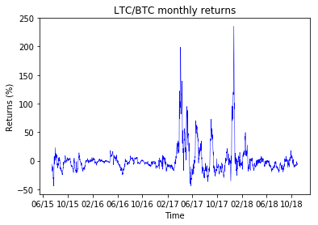

[](http://quantlet.de/)

## [](http://quantlet.de/) **RL_CoinReturnsFigures** [](http://quantlet.de/)

```yaml


Name of Quantlet: RL_CoinReturnsFigures

Published in: 'A leveraged investment strategy using Deep Reinforcement Learning'

Description: 'Draws figures of all monthly coin returns (relative to Bitcoin) for all coins used in the Thesis experiments (from 07/2015 to 10/2018, if available).'

Keywords: 'reinforcement learning, neural network, machine learning, portfolio management, cryptocurrency'
 
Author: Ilyas Agakishiev

See also: RL_MainComputation, RL_CoinFigures

Submitted: 23.04.2019

Input: 
- df: "Coin prices, contained in the CSV-files of the 'Database' folder"
```





















### PYTHON Code
```python

import pandas as pd
import matplotlib.pyplot as pl
import matplotlib.dates as mdates

coin = ["ETC", "BCH", "DASH", "DGB", "ETH", "FCT", "GNT", "LTC", "rev_USDT",
        "STR", "XEM", "XMR", "XRP", "ZEC"]

print("Processing...")

for i in coin:
    print(i)
    # Import from "Database"    
    df      = pd.read_csv("<path>/" + i + ".csv")
    df.date = df.date.astype(int)
    df      = df.sort_values(by = "date")
    df      = df[df.date % (900*48) == 0]
    df.date = pd.to_datetime(df.date, unit = 's')
    df      = df[df.date >= "07/01/2015"]
    df      = df[df.date < "11/01/2018"]
    df["Returns"] = 0
    for j in range(30, len(df.iloc[:, 0])):
        df.Returns.iloc[j] = (df.close.iloc[j] - df.close.iloc[j-30]) / df.close.iloc[j-30] * 100
    df      = df.iloc[30:, :]    
    fig, ax = pl.subplots(figsize = (6, 4))
    pl.plot(df.date, df.Returns, color = "blue", linewidth = 0.5)
    ax.xaxis.set_major_formatter(mdates.DateFormatter("%m/%y"))
    pl.xlabel("Time") 
    pl.ylabel("Returns (%)")
    pl.title(i + "/BTC monthly returns")
    if (i == "rev_USDT"):
        pl.title("USDT/BTC monthly returns")
    fig.savefig(i + "ret.png", bbox_inches = "tight")
```

automatically created on 2019-05-13