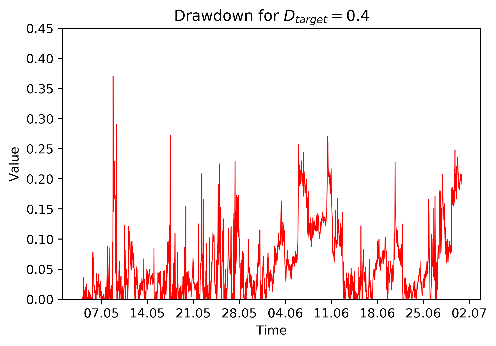
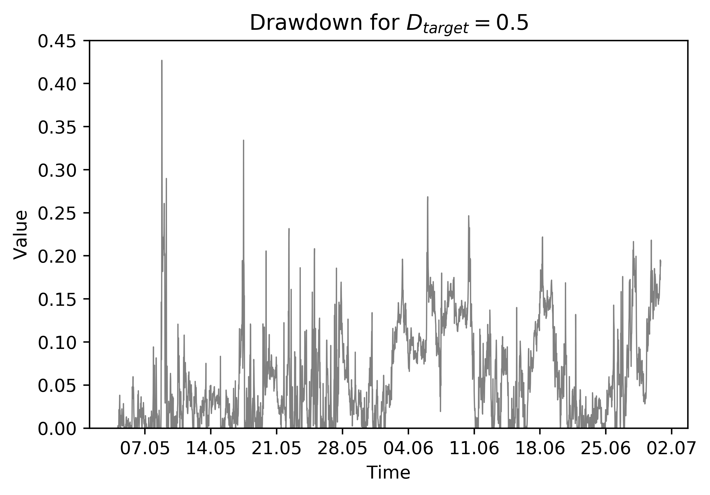

[](http://quantlet.de/)

## [](http://quantlet.de/) **RL_DrawdownFigures** [](http://quantlet.de/)

```yaml


Name of Quantlet: RL_DrawdownFigures

Published in: 'A leveraged investment strategy using Deep Reinforcement Learning'

Description: 'Outputs the drawdown for each time period as a plot.'

Keywords: 'reinforcement learning, neural network, machine learning, portfolio management, cryptocurrency'
 
Author: Ilyas Agakishiev

See also: RL_MainComputation, RL_CoinFigures

Submitted: 23.04.2019

Input: 
- df: Tables '10mdd.csv', '40mdd.csv' or '50mdd.csv', which contain drawdowns from Experiment 1 with a target drawdown of 10%, 40% and 50%, respectively.
```






### PYTHON Code
```python

import pandas as pd
from datetime import datetime, timedelta
import matplotlib.pyplot as plt
from matplotlib.dates import DateFormatter

df = pd.read_csv('<path>/10mdd.csv', sep = ";")

df.iloc[0, 0] = datetime(2017, 5, 4, 0, 0, 0)
for i in range(1, len(df.iloc[:, 0])):
    df.iloc[i, 0] = df.iloc[i-1, 0] + timedelta(minutes = 30)
    
new_x = df.iloc[:, 0]
fig   = plt.figure()
ax    = fig.add_subplot(111, label = "1")
ax.set_ylim([0, 0.45])
ax.xaxis.set_major_formatter(DateFormatter('%d.%m'))
ax.plot_date(new_x, df.iloc[:, 1], fmt = "b-", tz = None, xdate = True, 
             linewidth = 0.8)
plt.title("Drawdown for " + r"$D_{target} = 0.1$")
plt.xlabel("Time")
plt.ylabel("Value")
```

automatically created on 2019-05-13