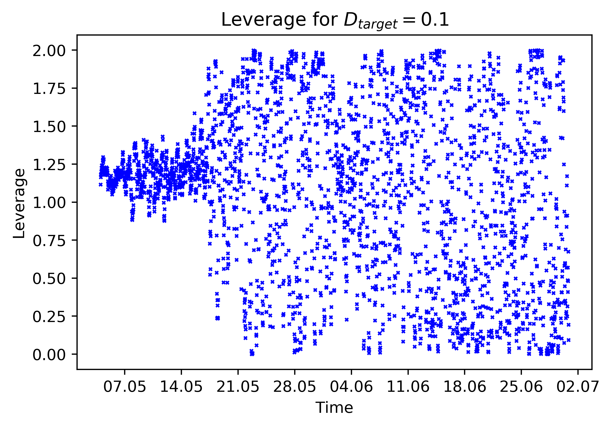

[](http://quantlet.de/)

## [](http://quantlet.de/) **RL_Experiment1Leverage** [](http://quantlet.de/)

```yaml


Name of Quantlet: RL_Experiment1Leverage

Published in: 'A leveraged investment strategy using Deep Reinforcement Learning'

Description: 'Outputs the leverage for each time period as a plot.'

Keywords: 'reinforcement learning, neural network, machine learning, portfolio management, cryptocurrency'
 
Author: Ilyas Agakishiev

See also: RL_MainComputation, RL_Experiment2Leverage, RL_Experiment1Performance

Submitted: 23.04.2019

Input: 
- df: Table 'weights1', which contains total leverage from Experiment 1.
```



### PYTHON Code
```python

import pandas as pd
from datetime import datetime, timedelta
import matplotlib.pyplot as plt
from matplotlib.dates import DateFormatter

df = pd.read_csv('<path>/weights1.csv', sep = ";")

df.iloc[0, 0] = datetime(2017, 5, 4, 0, 0, 0)
for i in range(1, len(df.iloc[:, 0])):
    df.iloc[i, 0] = df.iloc[i-1, 0] + timedelta(minutes = 30)
    
new_x = df.iloc[:, 0]
fig   = plt.figure()
ax    = fig.add_subplot(111, label = "1")
ax.xaxis_date()
ax.set_xlim(["05/01/2017","07/03/2017"])
ax.xaxis.set_major_formatter(DateFormatter('%d.%m'))
plt.scatter(new_x.tolist(), df.iloc[:, 1], c = "blue", s = 2, marker = "x")
plt.title("Leverage values for " + r"$D_{target} = 0.1$")
plt.xlabel("Time")
plt.ylabel("Leverage")
plt.show()

```

automatically created on 2019-05-13