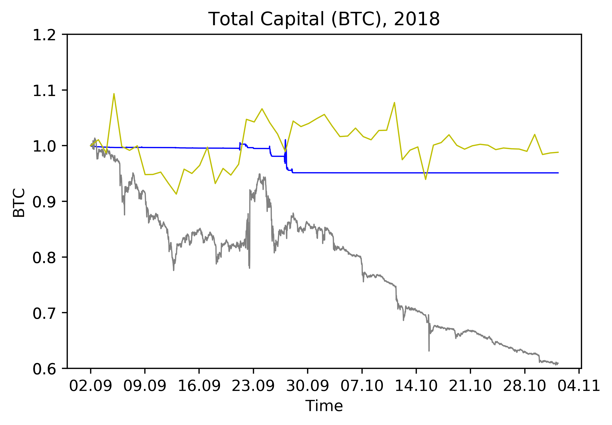

[](http://quantlet.de/)

## [](http://quantlet.de/) **RL_Experiment2Performance** [](http://quantlet.de/)

```yaml


Name of Quantlet: RL_Experiment2Performance

Published in: 'A leveraged investment strategy using Deep Reinforcement Learning'

Description: 'Outputs the performance of the algorithm for the test period as a plot. Additionally plots performance of (modified) CRIX and the algorithm without leverage.'

Keywords: 'reinforcement learning, neural network, machine learning, portfolio management, cryptocurrency'
 
Author: Ilyas Agakishiev

See also: RL_MainComputation, RL_Experiment2Leverage, RL_Experiment1Performance

Submitted: 23.04.2019

Input: 
- df: Table 'Performance2', which contains total capital for the algorithm, the no-leverage values and CRIX from Experiment 2 in the test period.
```



### PYTHON Code
```python

import pandas as pd
from datetime import datetime, timedelta
import matplotlib.pyplot as plt
from matplotlib.dates import DateFormatter

df = pd.read_csv('<path>/Performance2.csv', sep=";")

df.iloc[0, 0] = datetime(2018, 9, 2, 0, 0, 0)
for i in range(1, len(df.iloc[:,0])):
    df.iloc[i, 0] = df.iloc[i-1, 0] + timedelta(minutes = 30)
df.iloc[:,3]=pd.to_datetime(df.iloc[:,3], format='%d/%m/%Y')
    
new_x = df.iloc[:, 0]
fig   = plt.figure()
ax    = fig.add_subplot(111, label = "1")
ax2   = fig.add_subplot(111, label = "2", frame_on = False)
ax3   = fig.add_subplot(111, label = "3", frame_on = False)
ax.set_ylim([0.6, 1.2])
ax2.set_ylim([0.6, 1.2])
ax3.set_ylim([0.6, 1.2])
ax2.tick_params(
    axis        = 'both',        
    which       = 'both',      
    bottom      = False,       
    left        = False,       
    labelbottom = False)  
ax3.tick_params(
    axis        = 'both',        
    which       = 'both',       
    bottom      = False,       
    left        = False,         
    labelbottom = False)  
ax.xaxis.set_major_formatter(DateFormatter('%d.%m'))
ax.plot_date(new_x, df.iloc[:, 1], fmt = "b-", tz = None, xdate = True, 
             linewidth = 0.8)
ax2.plot_date(new_x,df.iloc[:, 2],fmt = "-", color = "gray",tz = None, 
              xdate = True, linewidth = 0.8)
ax3.plot_date(df.iloc[:, 3], df.iloc[:, 4], fmt = "y-", tz = None, 
              xdate = True, linewidth = 0.8)
ax2.set_yticklabels([])
ax3.set_yticklabels([])
plt.title("Total capital (BTC), 2018")
plt.xlabel("Time", labelpad = 20)
plt.ylabel("Leverage", labelpad = 20)
plt.show()

```

automatically created on 2019-05-13